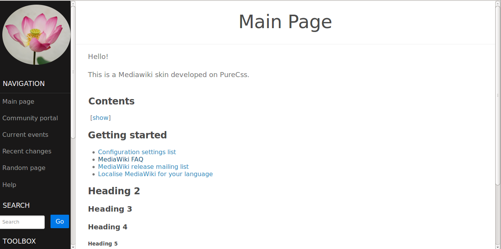
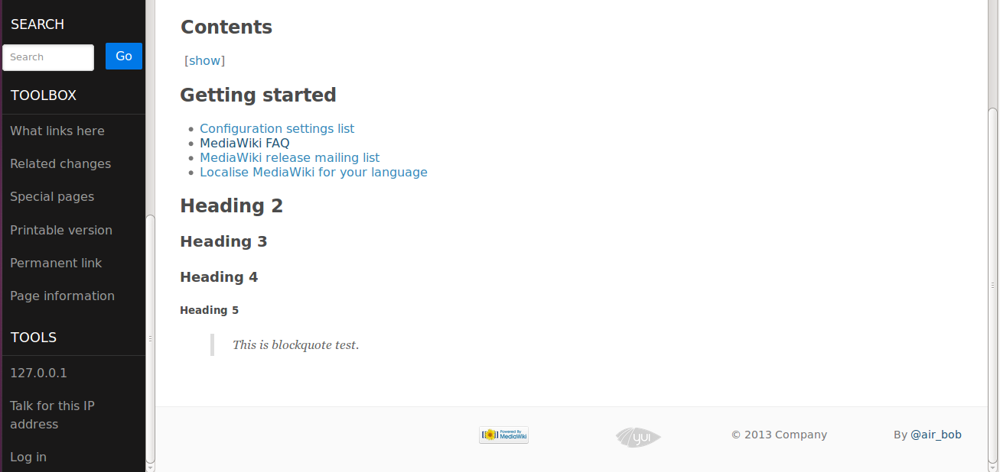
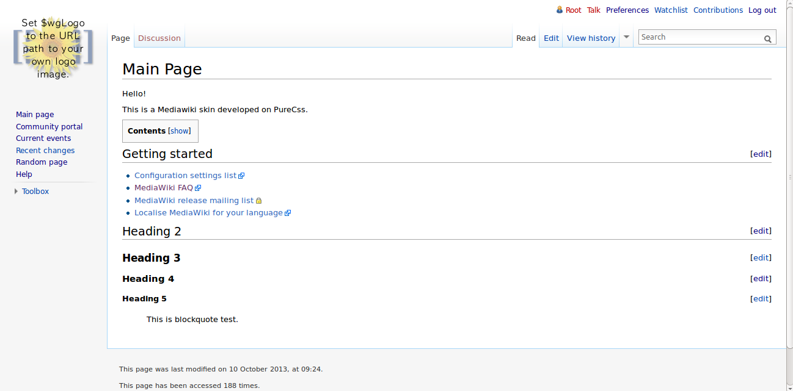

## MediaWiki_Skin_PureCss ##

> A MediaWiki skin using [PureCss(Yahoo)](http://purecss.io/)

### How to use ###
1. You should have installed [Mediawiki](http://www.mediawiki.org/wiki/MediaWiki) on your server<br>
2. Go to *MediaWiki root directory* and go to *skins*<br>
3. Put ```PureCss.php``` and ```purecss``` folder to skins directory<br>
4. You logo files is ```purecss/logo.png```
5. Modify ```LocalSettings.php``` in your MediaWiki root directory<br>

```lang="php"
## Default skin: you can change the default skin. Use the internal symbolic
## names, ie 'standard', 'nostalgia', 'cologneblue', 'monobook', 'vector':
$wgDefaultSkin = "purecss";

```

### How it looks ###

Here is how the wiki looks like after updating skin setting<br>
screenshot 1: <br><br>
 <br>
screenshot 2: <br><br>
 <br>
<br>
Compared with default vector skin<br>
 <br>


Have fun, My email: air.chenbo@gmail.com 

### MediaWiki skin locations 
Skin is on [MediaWiki](https://www.mediawiki.org/wiki/Skin:PureCss)
